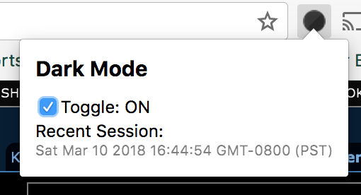
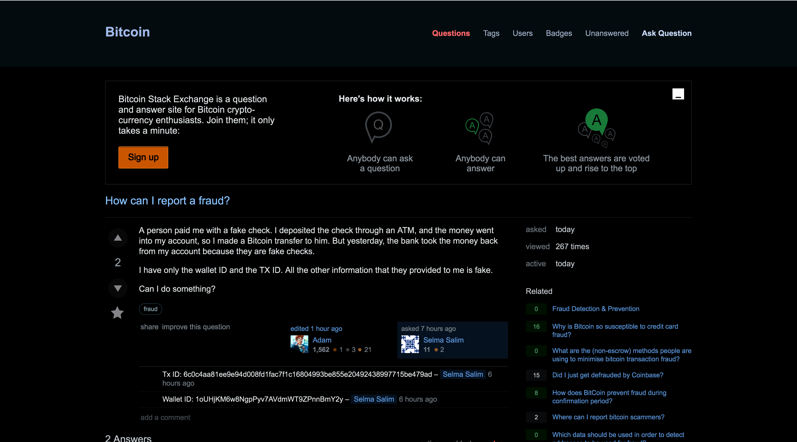
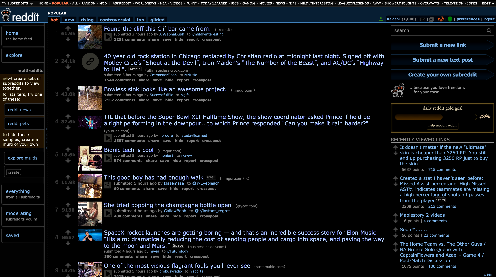
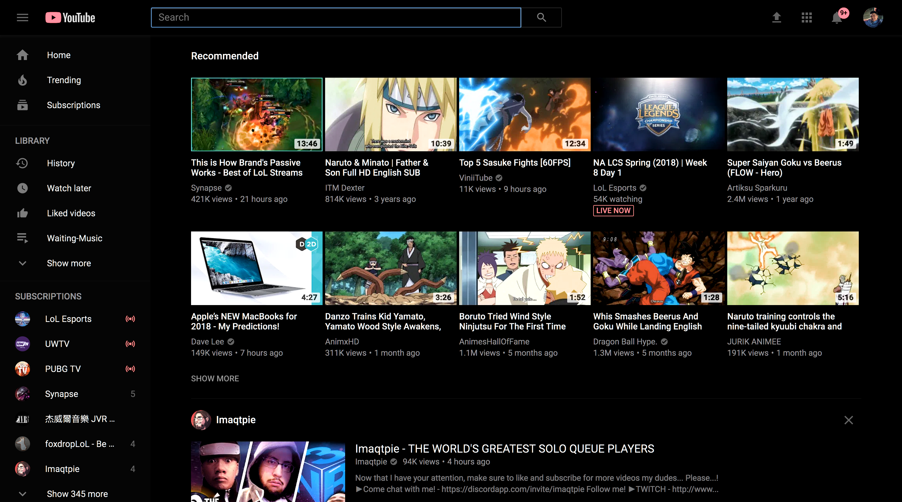
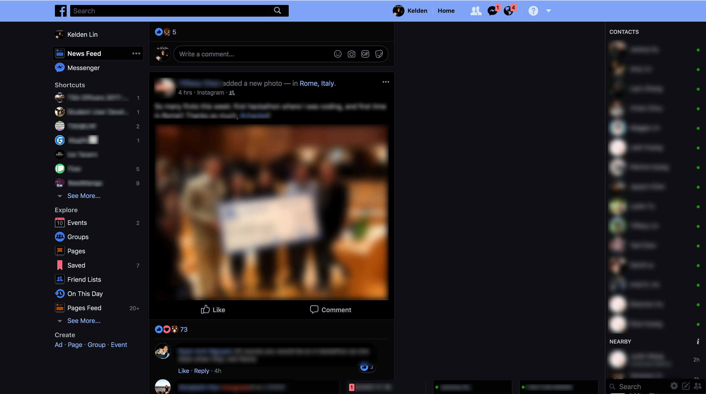

# Chrome-Dark-Mode
## Table of Contents
1. [What is it?](#what-is-it)
2. [Sample Dark Mode Websites](#sample-dark-mode-websites)
3. [Installation](#installation)
4. [References](#references)

_Note: I made some changes after the assignment was due, but those were little visual changes that didn't affect the project. (so you don't have to count it in)_

## What is it?

“Chrome Dark Mode” does exactly what the title implies – it changes your webpages’ styles to a slick dark mode websites nowadays rock. Not only that, it will also collect the user’s preference on dark mode based on the data from user usage, and smarty understand and therefore nicely graph that collected information. As a stretch goal, I could possibly even adapt and learn from that collected data and as a feature turn on and off the extension based on the user’s preferences and habits. 

## Sample Dark Mode Websites

_Stack Overflow_

_Reddit_

_Youtube_

_Facebook_

## Installation
Download the repo as a zip file. Then do the following:
> 1. Visit chrome://extensions in your browser (or open up the Chrome menu by clicking the icon to the far right of the Omnibox:  The menu's icon is three horizontal bars. and select Extensions under the More Tools menu to get to the same place).
> 2. Ensure that the Developer mode checkbox in the top right-hand corner is checked.
> 3. Click Load unpacked extension… to pop up a file-selection dialog.
> 4. Navigate to the directory in which your extension files live, and select it.

Alternatively, you can drag and drop the directory where your extension files live onto chrome://extensions in your browser to load it.

## References
[Google's Chrome Extension Documentation](https://developer.chrome.com/extensions/)